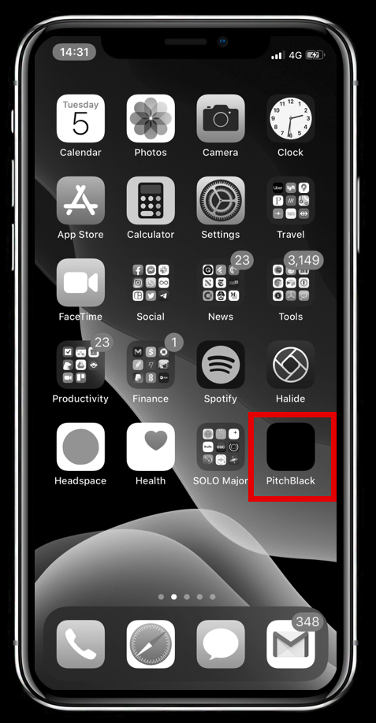
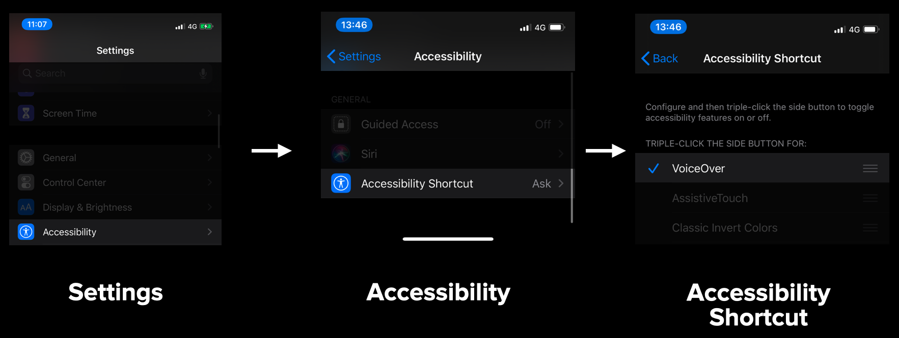
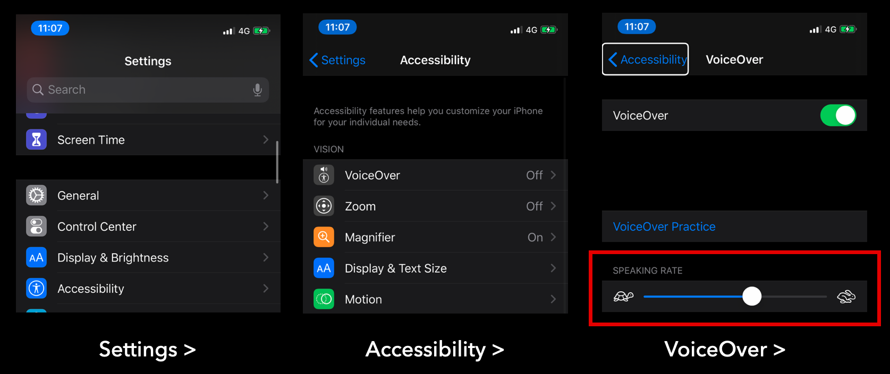
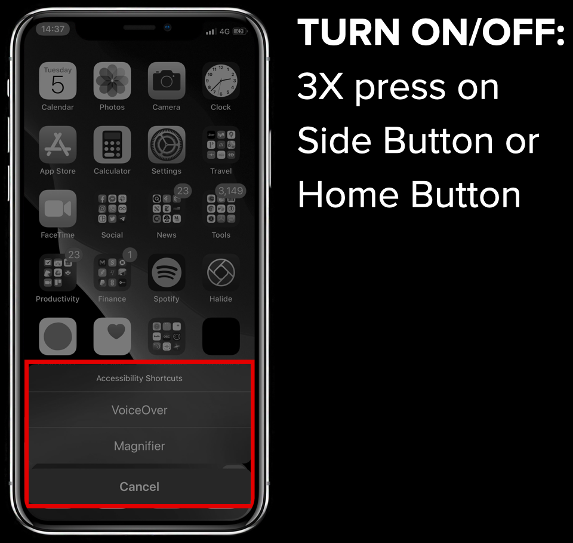

# INSTRUCTIONS

## 1. Clone the repo

## 2. Build & run the Xcode project

## 3. Put the PitchBlack app on your homescreen 

## 4. Enable Accessibliity Shortcut for VoiceOver

* Go to Settings > Accessibility > Accessibility Shortcut
* Select VoiceOver

## 5. Set the speed

* Go to Settings > Accessibility > Voice Over
* Change the speed to somewhere between 50% and 70%, otherwise you won't be able to understand it

## 6. Go Home and try it out!
* Go back to your home screen
* Tripple press the Home or Side button to turn VoiceOver on or off

This is the accompanying app for AppBuilder 2020, talk UI Mode: Pitch Black.
